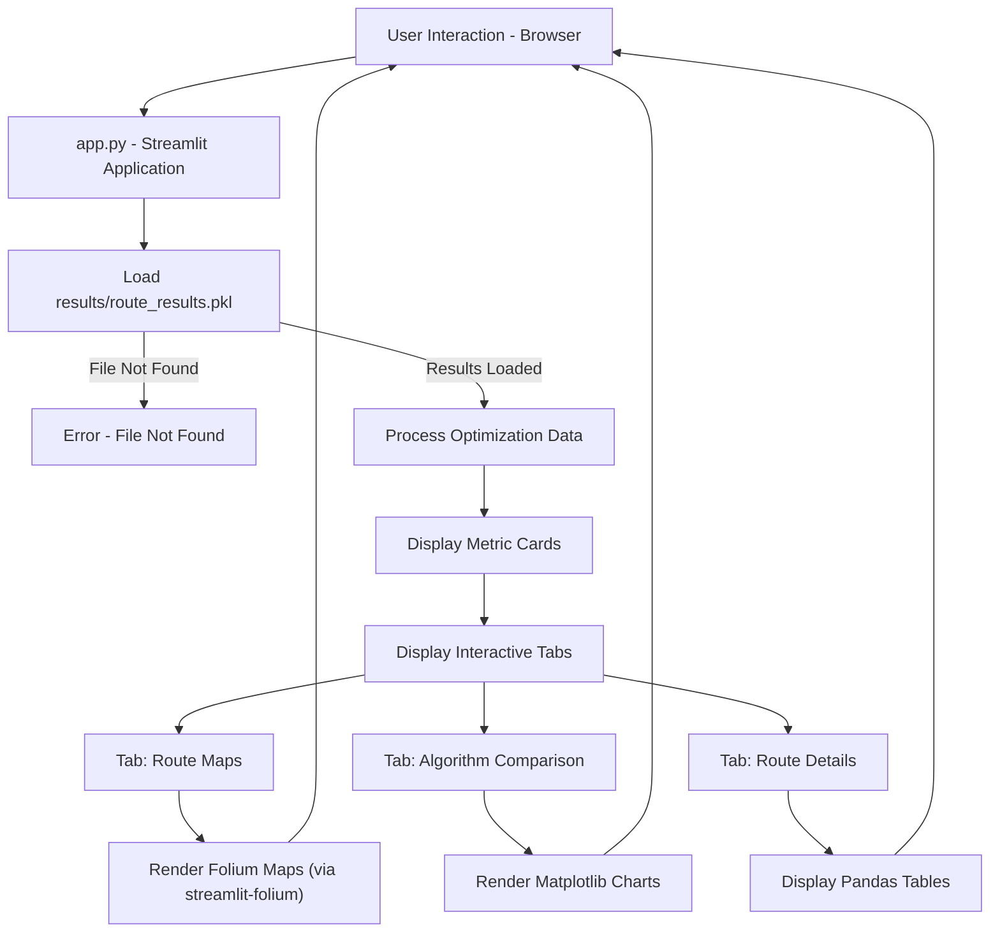
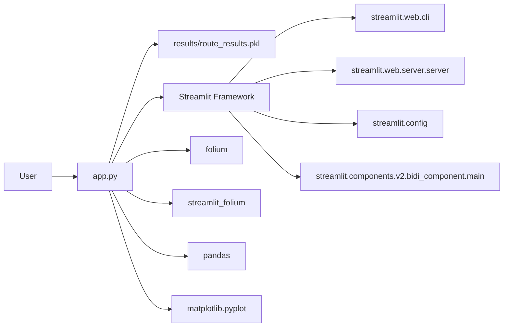

# CodeOwn

## 1. PROJECT OVERVIEW
**In plain English**
This project provides an interactive web application that visualizes and compares different route optimization algorithms for supply chain logistics. It takes pre-computed results, likely generated by a separate optimization script, and presents them through an intuitive dashboard. The application highlights the effectiveness of Genetic Algorithms (GA) and Simulated Annealing (SA) in reducing travel distance compared to a simple, "naive" sequential route.

The primary problem it solves is making complex route optimization outcomes easily digestible and comparable for decision-makers. It enables users to visually inspect routes on a map, examine performance metrics, and review detailed route specifics for various algorithms, facilitating informed choices in logistics planning.

The final outcome is a comprehensive, interactive dashboard that allows a developer or logistics analyst to understand and compare the performance of multiple vehicle routing problem (VRP) solutions without needing to dive into the underlying optimization code.

**System type**
This appears to be a Python-based interactive data visualization web application built with Streamlit.

**User / input / output**
- User: Logistics analysts, supply chain managers, or developers interested in route optimization comparisons.
- Input: A pickled file (`results/route_results.pkl`) containing pre-computed route optimization data, including node coordinates, route sequences, and distances for different algorithms. User interactions via the Streamlit web interface (e.g., selecting tabs, viewing maps).
- Output: Interactive maps displaying optimized routes, metric cards summarizing route performance (distances, reductions), comparison charts, and tabular route details presented in a web browser.

**Tech stack**
- Languages: Python, JavaScript (for Streamlit frontend components)
- Frameworks: Streamlit, Folium (for mapping)
- Libraries: pandas, matplotlib, pickle, streamlit-folium, numpy (underlying data operations)
- Runtime Tools: Python environment (e.g., via `.venv`)

**Architectural purpose**
The parts exist together to transform pre-calculated supply chain route optimization results into an accessible and interactive web-based visualization and analysis tool.

## 2. SYSTEM FLOW
Input arrives (user launches `app.py` in Streamlit)
-> `app.py` initializes the Streamlit application and page configuration.
-> `app.py` attempts to load pre-computed optimization results from `results/route_results.pkl`.
-> **Condition**: Is `results/route_results.pkl` found and loaded successfully?
    -> NO -> `app.py` displays an error message and terminates the application flow.
    -> YES -> `app.py` unpacks the various route data (nodes, labels, naive route, GA route, SA route, distances, reductions) from the loaded pickle file.
    -> `app.py` displays high-level metric cards summarizing route distances and optimization reductions.
    -> `app.py` creates an interactive tabbed interface (Route Maps, Algorithm Comparison, Route Details).
    -> **User selects "Route Maps" tab**:
        -> `app.py` calls its `build_map` function twice, once for the naive route and once for the best-performing optimized route (GA or SA).
        -> `app.py` uses `folium` to construct interactive map objects with markers and polyline routes.
        -> `app.py` embeds these maps into the Streamlit UI using `streamlit_folium.st_folium`.
    -> **User selects "Algorithm Comparison" tab**:
        -> `app.py` (though not fully shown in snippet, likely) generates comparison charts using `matplotlib`.
    -> **User selects "Route Details" tab**:
        -> `app.py` (likely) displays detailed route data in a tabular format, probably using `pandas` DataFrames.
-> Final output (interactive web dashboard) is produced and displayed to the user in the browser.

## 3. FILE BREAKDOWN
### app.py
**What it does**
This is the main Streamlit application that loads pre-calculated route optimization results, processes them, and renders an interactive web dashboard for visualization and comparison.

**Receives input from**
- User: Initial launch command (e.g., `streamlit run app.py`), interactions with the Streamlit UI (tab clicks, map interactions).
- Config: `st.set_page_config` defines page title, icon, and layout.
- File: `results/route_results.pkl` (deserialized Python object containing optimization data).

**Sends output to**
- API response: Streamlit frontend for rendering the interactive web UI.
- Runtime target: Standard output/error for logs or missing file warnings.

**Connected to**
- Loads data from `results/route_results.pkl`.
- Consumes `streamlit` for UI elements and application runtime.
- Employs `folium` to create geographic maps.
- Utilizes `streamlit_folium` to display `folium` maps within Streamlit.
- Uses `pandas` for data structuring and display (inferred for "Route Details" tab).
- Imports `matplotlib.pyplot` for generating charts (inferred for "Algorithm Comparison" tab).

### .venv/Lib/site-packages/streamlit/web/server/server.py
**What it does**
This file manages the core HTTP/WebSocket server for a Streamlit application, handling client connections, routing requests, and managing the overall runtime.

**Receives input from**
- Config: Streamlit's global configuration (`streamlit.config`) for server settings (e.g., port, address, SSL options).
- Runtime source: HTTP requests from web browsers, WebSocket messages from connected clients.

**Sends output to**
- API response: Client web browsers (HTML, static assets, dynamic UI updates via WebSockets).
- Model: Manages `streamlit.runtime` state, `MediaFileStorage`, `MemorySessionStorage`, and `MemoryUploadedFileManager`.

**Connected to**
- Utilizes `streamlit.config` to retrieve server settings.
- Delegates request handling to `streamlit.web.server.routes` for general HTTP routes.
- Connects with `streamlit.web.server.browser_websocket_handler` for real-time client-server communication.
- Integrates `streamlit.web.server.bidi_component_request_handler` and `streamlit.web.server.component_request_handler` for custom component interactions.
- Uses `streamlit.web.cache_storage_manager_config` to configure cache storage.

### .venv/Lib/site-packages/streamlit/config.py
**What it does**
This file is the central module for managing Streamlit's application-wide configuration options, including loading from files, environment variables, and command-line arguments.

**Receives input from**
- Config: `config.toml` files (global, project, script-specific), environment variables, command-line arguments.
- Runtime source: Direct calls to `set_option` or `get_option` from other Streamlit modules or user scripts.

**Sends output to**
- Runtime target: Provides configuration values to other Streamlit components that query options.
- API response: Can print current configuration to the console (`show_config`).

**Connected to**
- Consumes `streamlit.config_option` to define and manage individual configuration options.
- Utilizes `streamlit.config_util` for utilities related to processing and displaying configuration.
- Imports `toml` for parsing TOML-formatted configuration files.

### .venv/Lib/site-packages/streamlit/components/v2/bidi_component/main.py
**What it does**
This file provides the core functionality for Streamlit's bidirectional components (v2), enabling complex interactions between Python backend and custom JavaScript/frontend components.

**Receives input from**
- `app.py`: Python code invoking Streamlit component functions (e.g., `st.components.v2.component`).
- Runtime source: Frontend events or state changes from the custom component rendered in the browser.

**Sends output to**
- API response: Sends serialized data and presentation instructions to the Streamlit frontend.
- Model: Updates internal component state based on frontend interactions.

**Connected to**
- Is called by user scripts (like `app.py` if it were using custom components).
- Utilizes `streamlit.components.v2.bidi_component.serialization` for data exchange with the frontend.
- Interacts with `streamlit.runtime.state` to manage widget state.
- Employs `streamlit.dataframe_util` to handle data serialization, particularly for Pandas DataFrames.

### .venv/Lib/site-packages/streamlit/web/cli.py
**What it does**
This file defines the command-line interface (CLI) for Streamlit, allowing users to run Streamlit applications, manage cache, and configure settings from the terminal.

**Receives input from**
- User: Command-line arguments (e.g., `streamlit run app.py`, `streamlit config show`).
- Config: `streamlit.config` for accessing and modifying application settings.

**Sends output to**
- Runtime target: Orchestrates the launch of Streamlit applications (`streamlit.web.bootstrap`).
- API response: Prints information to the console (e.g., help messages, config details).

**Connected to**
- Calls `streamlit.web.bootstrap` to start the Streamlit server and run the user script.
- Interacts with `streamlit.config` to handle configuration-related CLI commands.
- Uses `click` library for command-line argument parsing.

## 4. SYSTEM FLOW DIAGRAM

## 5. FILE DEPENDENCY GRAPH

## Mental Model
*   **A Visualization Layer over Pre-Computed Data:** This project is primarily a presentation layer. It does not perform the actual supply chain route optimization itself, but rather consumes and visualizes results from a separate, unprovided optimization process (implied by `optimize.py`).
*   **Streamlit as the Core UI Framework:** The entire interactive user interface and web hosting capabilities are provided by Streamlit, making the application easy to develop and deploy with Python.
*   **Modular Display for Comparison:** The use of tabs (Maps, Comparison, Details) allows for a structured and direct comparison of different optimization algorithms (Naive, GA, SA) on multiple fronts.
*   **Dependency on Data Artifact:** The application's functionality is entirely dependent on the existence and correct format of the `results/route_results.pkl` file, which acts as its primary data source.
*   **Interactive Mapping for Spatial Understanding:** The integration of Folium maps is key to visually understanding the geographical impact of the different routing solutions.
